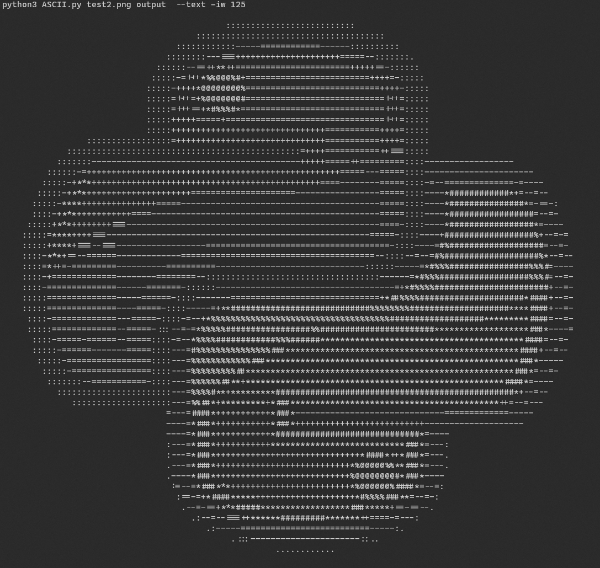

# ASCII ART

 A command-line tool to convert any Image to made up of ASCII characters and also to make a coloured image with custom string in it(See examples below).

## Installation

Clone the repository 
```
git clone https://github.com/SukhmeetSingh2002/Image-to-ASCII.git
```

Then run the following command to install all the dependencies
```
pip install - r requirements.txt
```

## Usage

Run the script using the following arguments

```python ASCII.py [-h] (--text | --image) [-w WIDTH] [-i] inputImage outputFile```

- ```--text``` flag for output to be in [text form](#ASCII-characters-image) or ```--image``` flag for output to a [coloured image](#Coloured-characters-image). Either of these is required for the program to work
- ```-w``` or ```--width``` flag to specify the width of the output image  
- ```-i``` flag to invert the colour of output image  
- ```inputImage```  Path to input image   
- ```outputFile```  Path to output file   
- ```-h``` or ```--help``` to print a help page   

## ASCII characters image

Run the script with ```--text``` flag and it will produce a ouput will consist of ASCII characters like the following



## Coloured characters image

Run the script with ```--image``` flag and it will produce a ouput will consist of coloured characters like the following (zoom to see the result)

